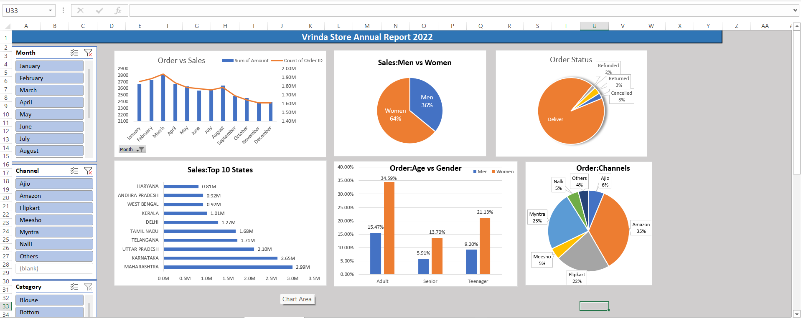

# Vrinda Store Annual Sales Analysis

## Project Overview
This project analyzes Vrinda Store sales data using Microsoft Excel.

## Objectives
- Analyze sales performance
- Identify top-performing states
- Understand customer demographics
- Evaluate sales channels

## Tools Used
- Microsoft Excel
- Pivot Tables
- Pivot Charts
- Slicers
- Dashboard Design

## Dashboard

## Key Insights

- Women contributed 64% of sales.
- Amazon was the highest-performing channel.
- Maharashtra generated the highest revenue.
- Adults were the largest customer segment.

## Files Included

- Excel Dashboard
- Sales Dataset
- Project Presentation
- Documentation

## Skills Demonstrated

- Data Cleaning
- Data Analysis
- Data Visualization
- Dashboard Development
- Business Insights
